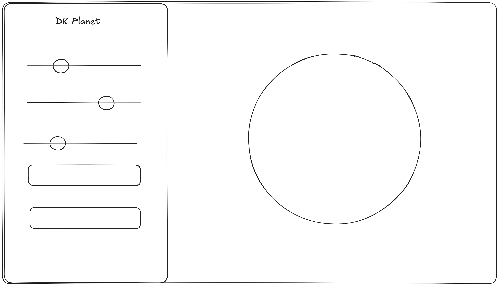

# Product Requirements Document

## Project Title

Procedural Generated Globe

## One-Sentence Goal

To show a spinning globe that is procedurally generated in WebGL.

## Core Features

- Create procedurally generated planets based on certain parameters
- Spin the globe around
- Display a globe in WebGL / Three.js
- Save planets in a library to create more of them

## Intended Pages

- **Gallery** - View all your planets
- **Planet Creator** - Create planets with a set of parameters
- **Planet Viewer** - Display and interact with planets
- **Parameter Panel** - Side panel for adjusting parameters of current procedurally generated planet

## Design & Interaction Notes

- Users will be able to drag and zoom into the planet they are viewing
- Users can have sliders for some parameters for the planets

## Wireframe

